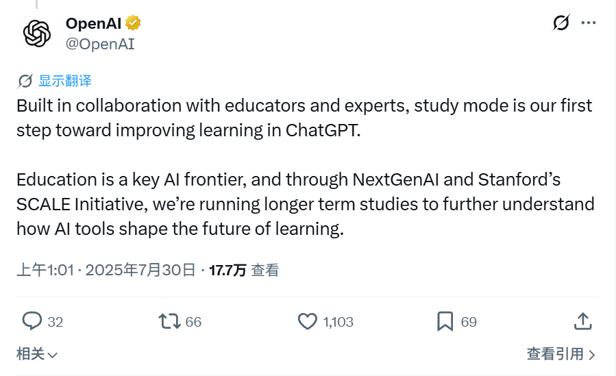
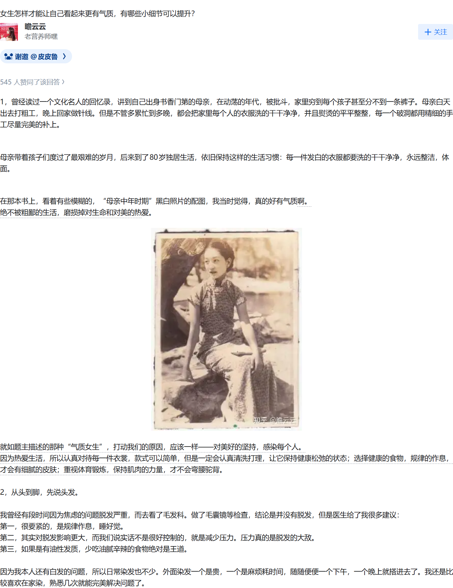
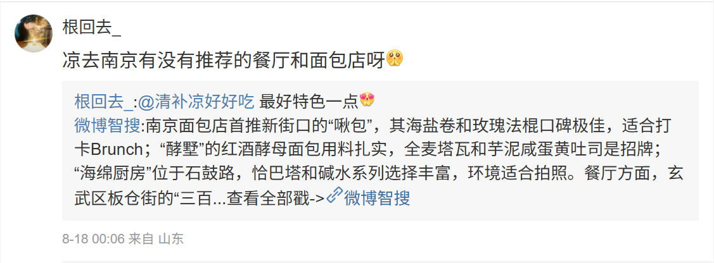
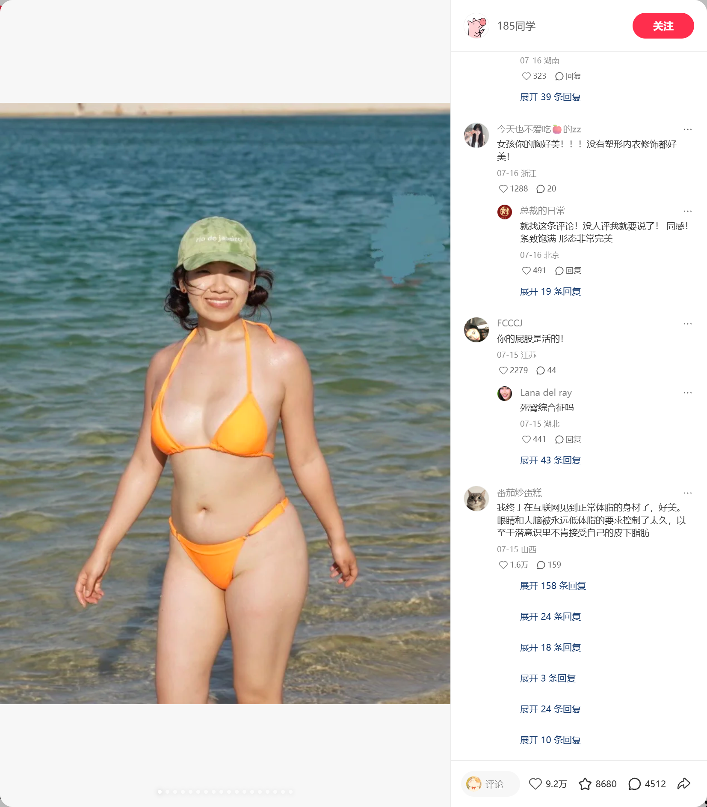

# social-capture

[中文](README.md) | [English](README.en.md)

> 给 AI 一个社交链接，它应该交回一张能直接引用的干净截图。
> 不是整页浏览器，不是半截正文，也不是带着导航栏、推荐流和登录信息的“截图事故”。

微博要展开全文，知乎长文要分片，X 必须精确命中目标推文，小红书既要正文也要评论，
抖音账号页至少要保留两排作品。看起来只是按一下截图，真正麻烦的全在按下之前和之后。

`social-capture` 把这段“最后一公里”封装成一个 CLI，也封装成 AI Agent 可以直接加载的 Skill。

## 先看结果

同一个浏览器页面，工具只保留真实内容卡片：



知乎长文超过 9:16 后会沿正文、图片和段落边界自动拆分；下面是其中一张实际输出：



再看另外两个已经验收的内容卡片：

<details>
<summary>微博：正文与转发卡片</summary>



</details>

<details>
<summary>抖音：账号页两排作品</summary>


</details>

<details>
<summary>小红书：笔记、轮播图与评论区</summary>



</details>

小红书这张公开演示素材包含泳装人物和公开评论区信息，仅用于展示截图边界；
真实使用时，Agent 应按用户指定目录保存，并遵循平台内容与隐私要求。

这五张图都不是手工裁剪。它们来自同一套命令：

```powershell
social-capture capture "<内容详情 URL>" --output-dir "E:\temp\social-capture\demo"
```

命令结束后，你得到的不只是一张 PNG，还会得到一份可验证的 `manifest.json`：来源、
尺寸、裁剪坐标、SHA-256、分片数量和失败原因都在里面。

## 为什么需要它

普通浏览器截图解决的是“把屏幕保存下来”；内容工作流需要的是“留下可以发布的证据图”。

`social-capture` 会自动完成这些事：

- 只截目标内容卡片，排除导航、推荐流、通知和当前登录用户信息。
- 微博自动展开全文，保留转发卡片、配图和视频封面。
- 知乎长回答、长文章自动拼接，再按最大 9:16 分成多张图。
- X 精确匹配 status ID，避免误截回复、引用或推荐推文。
- 小红书默认保留前 8 条评论，支持轮播图和视频封面。
- 抖音默认保留账号资料和两排作品，可调整为 1–4 排。
- Cookie、`xsec_token` 和签名参数不会进入日志或 manifest。

于是下一步就很简单：人可以直接发图，Agent 可以继续写推文、做研究或整理素材。

## 30 秒开始

环境要求：Python 3.11+，以及一个已登录目标平台、开启 CDP 的 Chrome。

```powershell
git clone https://github.com/yang0/social-capture.git
cd social-capture
python -m pip install -e .
social-capture doctor --json
```

如果 `doctor` 中 `playwright`、`pillow`、`browser.available` 都为 `true`，即可截图：

```powershell
social-capture capture "https://x.com/user/status/123" `
  --output-dir "E:\temp\social-capture\x-demo"
```

`--output-dir` 必填。工具没有默认下载目录，也不会把测试图片写进仓库。

## 让 AI Agent 自己安装

你可以直接把下面这段话交给 Codex、Claude Code 或 OpenCode：

```text
安装 https://github.com/yang0/social-capture：
1. 先检查本机是否已经存在 social-capture，避免重复 clone。
2. 克隆仓库并执行 python -m pip install -e .。
3. 把仓库的 skill/ 目录安装为名为 social-capture 的 Agent Skill。
4. 运行 social-capture doctor --json。
5. 只有 doctor 通过后才报告安装成功；不要输出 Cookie 或浏览器登录信息。
```

Agent 获取仓库后，可以根据自身类型把 `skill/SKILL.md` 放到下列位置：

| Agent | 项目级 Skill | 用户级 Skill |
|---|---|---|
| Codex | `.agents/skills/social-capture/SKILL.md` | `~/.agents/skills/social-capture/SKILL.md` |
| Codex 兼容目录 | `.codex/skills/social-capture/SKILL.md` | `~/.codex/skills/social-capture/SKILL.md` |
| Claude Code | `.claude/skills/social-capture/SKILL.md` | `~/.claude/skills/social-capture/SKILL.md` |
| OpenCode | `.opencode/skills/social-capture/SKILL.md` | `~/.config/opencode/skills/social-capture/SKILL.md` |

Windows PowerShell 用户级安装示例（以共享的 `.agents/skills` 为例）：

```powershell
$dest = "$env:USERPROFILE\.agents\skills\social-capture"
New-Item -ItemType Directory -Force $dest | Out-Null
Copy-Item -Recurse -Force .\skill\* $dest
```

安装完成后重启或刷新 Agent，调用 `/social-capture`，或者直接说：

```text
用 social-capture 截取这条内容，输出到 E:\temp\social-capture\result，
完成后读取 manifest.json 并告诉我生成了几张图。
```

## Agent 调用协议

为了让不同 Agent 得到一致结果，`skill/SKILL.md` 规定了固定流程：

1. 使用用户给出的详情 URL，不猜测、不编造链接。
2. 要求明确的输出目录，禁止写入仓库。
3. 先运行 `social-capture doctor --json`。
4. 执行截图，再读取 `manifest.json`。
5. 只使用 `status: "ok"` 的图片，并核对数量、尺寸和 SHA-256。
6. 遇到登录失效、验证码、内容删除或定位失败时如实退出，不自动绕过。

这意味着 Skill 不只是“教 AI 运行一条命令”，还约束它如何判断成功、如何保护隐私、
以及什么时候必须承认失败。

## 五个平台，一套接口

```powershell
# 微博：详情 URL 或数字 ID
social-capture capture "https://m.weibo.cn/detail/<id>" `
  --output-dir "E:\temp\social-capture\weibo"

# 知乎：回答或文章，长内容自动分图
social-capture capture "https://www.zhihu.com/question/123/answer/456" `
  --output-dir "E:\temp\social-capture\zhihu"

# X：可用 --x-cut-stats 隐藏互动统计
social-capture capture "https://x.com/user/status/123" `
  --output-dir "E:\temp\social-capture\x"

# 小红书：默认保留 8 条评论；可遍历轮播图
social-capture capture "https://www.xiaohongshu.com/explore/<id>?xsec_token=..." `
  --output-dir "E:\temp\social-capture\xhs" --xhs-all-images

# 抖音：默认两排作品
social-capture capture "https://www.douyin.com/user/<sec_uid>" `
  --output-dir "E:\temp\social-capture\douyin" --douyin-rows 2

# 批量：每行一个 URL
social-capture capture --input .\urls.txt `
  --output-dir "E:\temp\social-capture\batch"
```

返回码：`0` 全部成功；`2` 参数、认证、浏览器或解析失败；`3` 批量任务部分成功。

## 搜索为什么没有硬塞进来

截图和搜索是两个不同问题。截图需要稳定地还原一个已知内容；搜索则依赖平台接口、
登录状态、频率限制和第三方项目许可证。把它们绑死，任何一个搜索后端失效都会拖垮截图。

所以核心只做截图；Agent 在用户明确要求搜索时运行：

```powershell
social-capture search-backends --json
```

当前会给出这些可选后端：

- 微博：`dataabc/weibo-search`
- X：`public-clis/twitter-cli`
- 小红书：`xpzouying/xiaohongshu-mcp`
- 抖音、知乎：`NanmiCoder/MediaCrawler`

Agent 必须先检查是否已安装，再阅读对应许可证和认证说明。工具本身不会静默 clone、安装
或执行第三方搜索项目。

## 认证与隐私

认证优先级：`--cookie-file` → 平台环境变量 → 已登录 Chrome CDP 会话。

支持的环境变量：`WEIBO_COOKIE`、`ZHIHU_COOKIE`、`X_COOKIE`、`XHS_COOKIE`、
`DOUYIN_COOKIE`。明确提供 Cookie 且 CDP 不可用时，工具才会启动临时 Chrome；
任务结束后关闭并清理。验证码和登录挑战会停止任务，不自动绕过。

小红书网页详情链接通常需要 `xsec_token`，也可以使用仍然有效的 `xhslink.com` 分享短链。
这些签名值会用于导航，但会从 manifest 和错误信息中移除。

## 输出可以被机器继续消费

```text
<用户指定目录>/
├── manifest.json
└── images/
    ├── <platform>-<content-id>-01-of-N.png
    └── <platform>-<content-id>-02-of-N.png
```

目标目录已有结果时默认安全失败。显式使用 `--overwrite` 后，也只会清理旧 manifest 明确
记录的图片，不递归删除用户的其他文件。

## 开发与扩展

Provider 接口是模块化的；新增平台不需要修改现有平台实现。参见
[`docs/provider-api.md`](docs/provider-api.md)。

```powershell
python -m pytest -q
python -m compileall -q src
ruff check .
git diff --check
```

AI 工作流入口见 [`skill/SKILL.md`](skill/SKILL.md)，认证说明见
[`docs/authentication.md`](docs/authentication.md)。

维护者：[@yang02010](https://x.com/yang02010) · License: MIT
